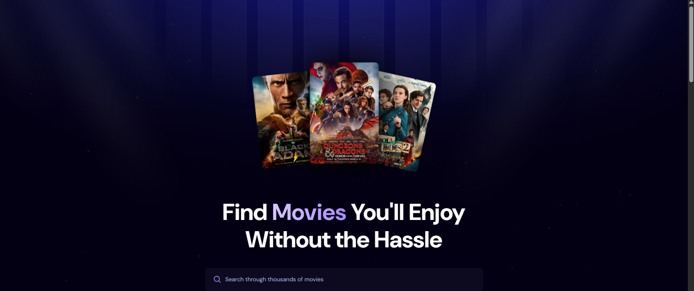
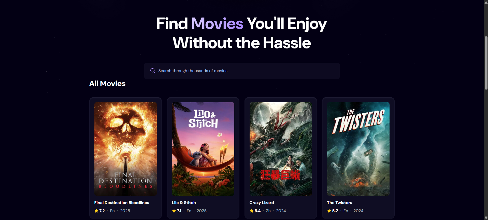

# Movie Search App

A React-based web application that allows users to search and browse movies using the [The Movie Database (TMDb) API](https://developer.themoviedb.org/docs). The app features a responsive design, debounced search functionality, and a clean user interface styled with Tailwind CSS.

## Features

- **Search Movies**: Search through thousands of movies with a debounced input to optimize API calls.
- **Browse Popular Movies**: View a list of popular movies when no search query is provided.
- **Responsive Design**: Optimized for both desktop and mobile devices using Tailwind CSS.
- **Loading and Error States**: Displays a spinner during API calls and handles errors gracefully.
- **Movie Details**: Displays key movie information like title, rating, language, and release year.

## Tech Stack

- **Frontend**: React, Tailwind CSS
- **API**: The Movie Database (TMDb) API
- **Dependencies**:
  - `react-use` for debouncing search input
  - Fonts: DM Sans, Bebas Neue (via Google Fonts)
- **Build Tool**: Vite

## Prerequisites

Before you begin, ensure you have the following installed:

- [Node.js](https://nodejs.org/) (v16 or higher recommended)
- A TMDb API key (sign up at [TMDb](https://www.themoviedb.org/) to get one)

## Installation

1. **Clone the repository**:
   ```bash
   git clone https://github.com/your-username/movie-search-app.git
   cd movie-search-app
   ```

2. **Install dependencies**:
   ```bash
   npm install
   ```

3. **Set up environment variables**:
   Create a `.env` file in the root directory and add your TMDb API key:
   ```env
   VITE_TMDB_API_KEY=your_api_key_here
   ```

4. **Start the development server**:
   ```bash
   npm run dev
   ```
   The app will be available at `http://localhost:5173` (or another port if specified).

## Usage

- **Search**: Enter a movie title in the search bar to find matching results. The search is debounced to reduce API calls, waiting 500ms after typing stops.
- **Browse**: On page load, the app displays a list of popular movies sorted by popularity.
- **View Details**: Each movie card shows the title, average rating, original language, and release year. If a poster is unavailable, a fallback image is displayed.

## Project Structure

```
movie-search-app/
├── src/
│   ├── components/
│   │   ├── MovieCard.jsx    # Component for rendering individual movie cards
│   │   ├── Search.jsx       # Component for the search bar
│   │   ├── Spinner.jsx      # Component for loading spinner
│   ├── App.jsx              # Main app component
│   ├── index.css            # Global styles with Tailwind CSS
│   └── assets/              # Static assets (images, etc.)
├── public/
│   ├── hero.png             # Hero banner image
│   ├── hero-bg.png          # Background pattern
│   ├── no-movie.png         # Fallback image for missing posters
│   ├── search.svg           # Search icon
│   ├── star.svg             # Rating star icon
├── .env.local               # Environment variables (not tracked)
├── package.json             # Project dependencies and scripts
└── README.md                # This file
```

## Available Scripts

- `npm run dev`: Starts the development server.
- `npm run build`: Builds the app for production.
- `npm run preview`: Previews the production build locally.

## Screenshots


Below are screenshots showcasing the app's key features:

| Feature | Screenshot |
|---------|------------|
| **Home Page** |  
| **Home Page** |  

## Contributing

Contributions are welcome! Please follow these steps:

1. Fork the repository.
2. Create a new branch (`git checkout -b feature/your-feature`).
3. Make your changes and commit (`git commit -m 'Add your feature'`).
4. Push to the branch (`git push origin feature/your-feature`).
5. Open a pull request.

## License

This project is licensed under the MIT License. See the [LICENSE](LICENSE) file for details.

## Acknowledgments

- [The Movie Database (TMDb)](https://www.themoviedb.org/) for providing the movie data API.
- [Tailwind CSS](https://tailwindcss.com/) for the utility-first CSS framework.
- [Vite](https://vitejs.dev/) for the fast build tool.
- [Google Fonts](https://fonts.google.com/) for DM Sans and Bebas Neue fonts.